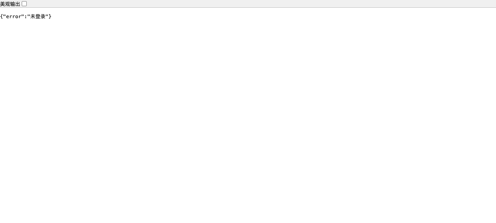
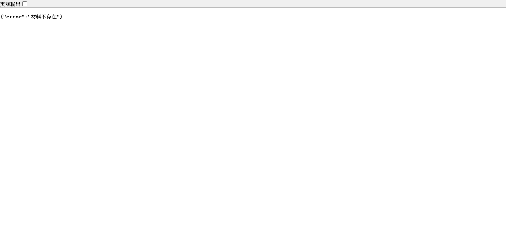
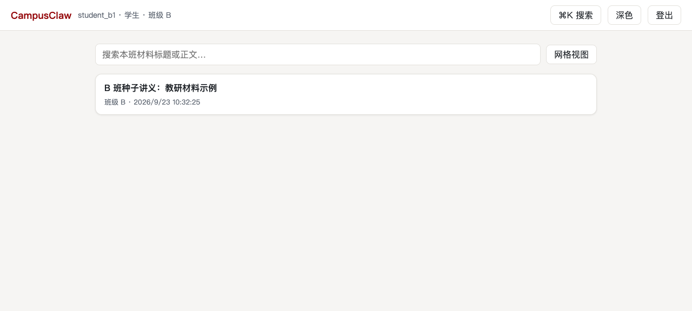
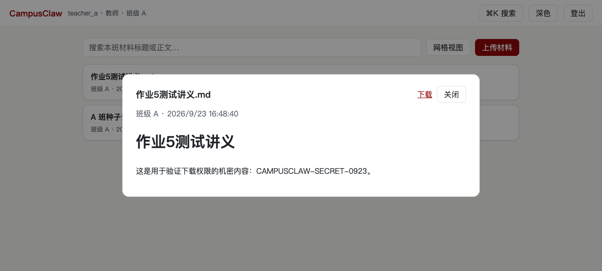

# 作业 5：CampusClaw 文件下载权限分析

> 分析对象：本人学期仓迭代 1 的下载实现（`backend/internal/materials/materials.go` 的 `File` / `fetchAuthorized`，`deploy/nginx.conf`），规约依据 `specs/auth-upload/spec.md` R1/R3/R5。

## 一、结论先行

**文件下载必须鉴权。** 本系统不存在任何"知道 URL 就能下"的公开文件地址：

- 未登录下载 → **401**；
- 已登录但材料属于其他班级 → **404**（与"材料不存在"完全同形，不泄露资源存在性）；
- 直接猜上传目录的磁盘路径（`/uploads/<文件名>`）→ **取不到文件**（该目录根本不对 Web 暴露）。

只有"持有有效会话 **且** 材料属于本会话班级"的用户，才能通过 `GET /api/materials/{id}/file` 取到文件。

## 二、实现逻辑

### 1. 唯一的下载通道是鉴权 API，不是静态文件

架构上有一个刻意设计：**上传目录不作为静态资源暴露**。Nginx 只托管前端静态页并反代 `/api`，`nginx.conf` 里没有任何指向 uploads 的 `location`/`alias`；Docker 层面 uploads 卷只挂载到 api 容器。所以文件只能经由 Go 后端的 `GET /api/materials/{id}/file` 流出——每一次下载都必经代码里的鉴权逻辑，没有"绕过代码直接到磁盘"的路径。

### 2. 下载请求的服务端处理链（代码执行顺序）

```
① 会话中间件      Cookie 中的会话 ID → HMAC 查 sessions 表（未过期）→ 连表读
                  用户/角色/班级；无效或缺失 → 401，响应体不含任何业务数据
② 先取行          按路径中的 id 查询 materials（故意不在 SQL 里过滤班级）
③ 再核对班级      行不存在 → 404 {"error":"材料不存在"}
                  行的 class_id ≠ 会话班级 → 写服务端安全日志，对外返回
                  与"不存在"逐字相同的 404（跨班与不存在的响应对调用方不可区分）
④ 读盘回传        校验全部通过后，Go 进程按库中 file_path 读文件并回传，
                  附 Content-Disposition 下载头
```

其中②③是"先取行再校验"（fetch-then-check）的对象级授权：知道材料的 ID 不等于有权访问它，这是防 BOLA/IDOR（水平越权）的关键。而"越权与不存在同形 404"是设计决策（design.md ADR-2）：返回 403 会确认资源存在、便于枚举扫描，404 则把存在性也隐藏起来，排障信息只留在服务端日志。

### 3. 为什么存储名也不能猜

落盘文件名是服务端生成的 32 位十六进制随机串（如 `09869e66c32c33ac….md`），客户端原始文件名只作展示标题、绝不参与路径构造。即使攻击者猜到原始文件名，也无法推出存储路径——这是防路径穿越与直接访问的第二道防线。

## 三、未授权不能访问的实测证据

测试材料：教师 A 上传的《作业5测试讲义.md》（id=6，含标记文本 `CAMPUSCLAW-SECRET-0923`），落库 `class_id=1`（A 班）。

### 证据 1：未登录直接请求文件 URL → 401

浏览器（未登录状态）直接打开 `http://localhost:8080/api/materials/6/file`：



页面显示 `{"error":"未登录"}`，HTTP 401——看不到文件内容的任何一个字节。curl 复核：`curl http://localhost:8080/api/materials/6/file` → `401 {"error":"未登录"}`。

### 证据 2：登录他班账号访问本班文件 → 404（且与"不存在"同形）

登录 **B 班学生 student_b1** 后，访问 A 班材料的文件 URL `/api/materials/6/file`：



再访问一个**根本不存在**的材料 ID `/api/materials/99999/file`：


两张截图逐字一致：都是 `404 {"error":"材料不存在"}`。调用方无法分辨"材料存在但无权访问"与"材料不存在"——跨班探测拿不到任何信息。curl 复核两次请求的状态码与响应体完全相同。

### 证据 3：绕过 API 直接猜存储路径 → 取不到文件

已知该文件的真实存储名（从数据库查到），直接在浏览器访问 `http://localhost:8080/uploads/09869e66c32c33ac0ee66f0060973ad4.md`：



返回的是前端应用页面（SPA 的 index.html），**不是文件内容**——因为 Nginx 配置里 uploads 目录从未作为静态资源暴露。

### 对照：本班教师正常下载

教师 A（材料所属班级）请求同一 URL `/api/materials/6/file`，服务端校验通过后正常返回文件全文。由于响应带 `Content-Disposition: attachment`，浏览器会将其保存为下载文件 `material-6.md`，打开后内容完整（含 `CAMPUSCLAW-SECRET-0923` 标记文本）：




同一份文件，鉴权通过可取、三类未授权场景全部取不到。

## 四、小结

下载权限的实现可以概括为三句话：**没有公开 URL**（uploads 不做静态暴露，唯一通道是鉴权 API）；**每次下载都重新鉴定身份与归属**（会话中间件 + 先取行再核对班级）；**失败不泄露信息**（未登录 401 无业务数据、跨班与不存在同形 404、存储名不可猜测）。这与上传侧的"白名单 + 事务"共同构成迭代 1 的完整访问控制闭环。
